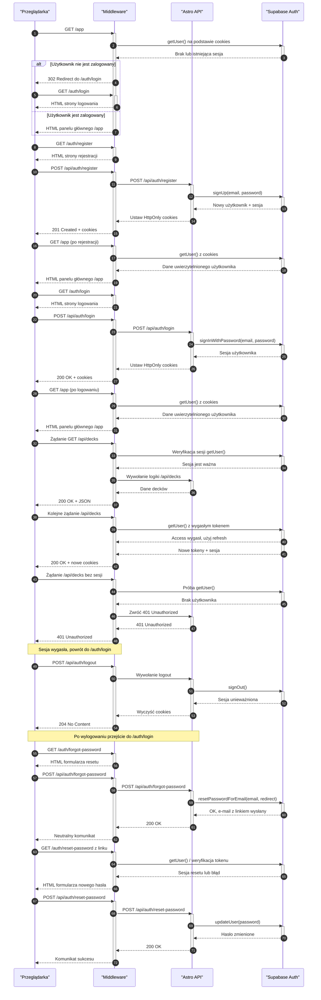

```mermaid
sequenceDiagram
  autonumber

  participant Browser as "Przeglądarka"
  participant Middleware as "Middleware"
  participant Api as "Astro API"
  participant Auth as "Supabase Auth"

  %% Wejście na stronę chronioną
  Browser->>Middleware: GET /app
  activate Middleware
  Middleware->>Auth: getUser() na podstawie cookies
  activate Auth
  Auth-->>Middleware: Brak lub istniejąca sesja
  deactivate Auth

  alt Użytkownik nie jest zalogowany
    Middleware-->>Browser: 302 Redirect do /auth/login

    Browser->>Middleware: GET /auth/login
    activate Middleware
    Middleware-->>Browser: HTML strony logowania
    deactivate Middleware
  else Użytkownik jest zalogowany
    Middleware-->>Browser: HTML panelu głównego /app
  end
  deactivate Middleware

  %% Rejestracja nowego użytkownika
  Browser->>Middleware: GET /auth/register
  activate Middleware
  Middleware-->>Browser: HTML strony rejestracji
  deactivate Middleware

  Browser->>Middleware: POST /api/auth/register
  activate Middleware
  Middleware->>Api: POST /api/auth/register
  activate Api
  Api->>Auth: signUp(email, password)
  activate Auth
  Auth-->>Api: Nowy użytkownik + sesja
  deactivate Auth
  Api-->>Middleware: Ustaw HttpOnly cookies
  deactivate Api
  Middleware-->>Browser: 201 Created + cookies
  deactivate Middleware

  Browser->>Middleware: GET /app (po rejestracji)
  activate Middleware
  Middleware->>Auth: getUser() z cookies
  activate Auth
  Auth-->>Middleware: Dane uwierzytelnionego użytkownika
  deactivate Auth
  Middleware-->>Browser: HTML panelu głównego /app
  deactivate Middleware

  %% Logowanie istniejącego użytkownika
  Browser->>Middleware: GET /auth/login
  activate Middleware
  Middleware-->>Browser: HTML strony logowania
  deactivate Middleware

  Browser->>Middleware: POST /api/auth/login
  activate Middleware
  Middleware->>Api: POST /api/auth/login
  activate Api
  Api->>Auth: signInWithPassword(email, password)
  activate Auth
  Auth-->>Api: Sesja użytkownika
  deactivate Auth
  Api-->>Middleware: Ustaw HttpOnly cookies
  deactivate Api
  Middleware-->>Browser: 200 OK + cookies
  deactivate Middleware

  Browser->>Middleware: GET /app (po logowaniu)
  activate Middleware
  Middleware->>Auth: getUser() z cookies
  activate Auth
  Auth-->>Middleware: Dane uwierzytelnionego użytkownika
  deactivate Auth
  Middleware-->>Browser: HTML panelu głównego /app
  deactivate Middleware

  %% Dostęp do chronionego API z ważną sesją
  Browser->>Middleware: Żądanie GET /api/decks
  activate Middleware
  Middleware->>Auth: Weryfikacja sesji getUser()
  activate Auth
  Auth-->>Middleware: Sesja jest ważna
  deactivate Auth
  Middleware->>Api: Wywołanie logiki /api/decks
  activate Api
  Api-->>Middleware: Dane decków
  deactivate Api
  Middleware-->>Browser: 200 OK + JSON
  deactivate Middleware

  %% Odświeżanie wygasłego access tokenu
  Browser->>Middleware: Kolejne żądanie /api/decks
  activate Middleware
  Middleware->>Auth: getUser() z wygasłym tokenem
  activate Auth
  Auth-->>Middleware: Access wygasł, użyj refresh
  Auth-->>Middleware: Nowe tokeny + sesja
  deactivate Auth
  Middleware-->>Browser: 200 OK + nowe cookies
  deactivate Middleware

  %% Brak możliwości odświeżenia sesji
  Browser->>Middleware: Żądanie /api/decks bez sesji
  activate Middleware
  Middleware->>Auth: Próba getUser()
  activate Auth
  Auth-->>Middleware: Brak użytkownika
  deactivate Auth
  Middleware->>Api: Zwróć 401 Unauthorized
  activate Api
  Api-->>Middleware: 401 Unauthorized
  deactivate Api
  Middleware-->>Browser: 401 Unauthorized
  deactivate Middleware

  Note over Browser,Middleware: Sesja wygasła, powrót do /auth/login

  %% Wylogowanie użytkownika
  Browser->>Middleware: POST /api/auth/logout
  activate Middleware
  Middleware->>Api: Wywołanie logout
  activate Api
  Api->>Auth: signOut()
  activate Auth
  Auth-->>Api: Sesja unieważniona
  deactivate Auth
  Api-->>Middleware: Wyczyść cookies
  deactivate Api
  Middleware-->>Browser: 204 No Content
  deactivate Middleware

  Note over Browser,Api: Po wylogowaniu przejście do /auth/login

  %% Odzyskiwanie hasła – inicjacja
  Browser->>Middleware: GET /auth/forgot-password
  activate Middleware
  Middleware-->>Browser: HTML formularza resetu
  deactivate Middleware

  Browser->>Middleware: POST /api/auth/forgot-password
  activate Middleware
  Middleware->>Api: POST /api/auth/forgot-password
  activate Api
  Api->>Auth: resetPasswordForEmail(email, redirect)
  activate Auth
  Auth-->>Api: OK, e-mail z linkiem wysłany
  deactivate Auth
  Api-->>Middleware: 200 OK
  deactivate Api
  Middleware-->>Browser: Neutralny komunikat
  deactivate Middleware

  %% Odzyskiwanie hasła – ustawienie nowego
  Browser->>Middleware: GET /auth/reset-password z linku
  activate Middleware
  Middleware->>Auth: getUser() / weryfikacja tokenu
  activate Auth
  Auth-->>Middleware: Sesja resetu lub błąd
  deactivate Auth
  Middleware-->>Browser: HTML formularza nowego hasła
  deactivate Middleware

  Browser->>Middleware: POST /api/auth/reset-password
  activate Middleware
  Middleware->>Api: POST /api/auth/reset-password
  activate Api
  Api->>Auth: updateUser(password)
  activate Auth
  Auth-->>Api: Hasło zmienione
  deactivate Auth
  Api-->>Middleware: 200 OK
  deactivate Api
  Middleware-->>Browser: Komunikat sukcesu
  deactivate Middleware
```
