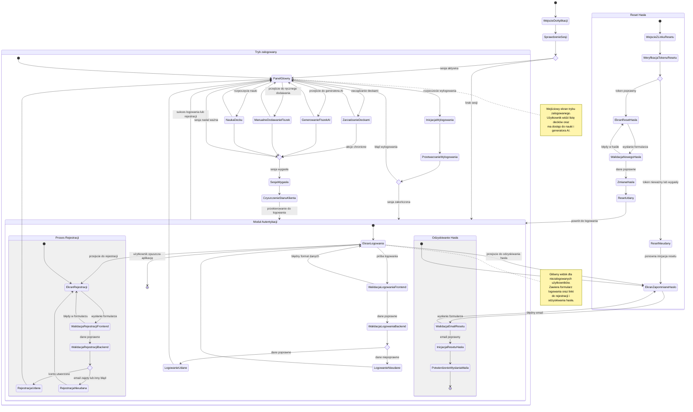

```mermaid
stateDiagram-v2

  [*] --> WejscieDoAplikacji

  WejscieDoAplikacji --> SprawdzenieSesji

  state ifSesjaIstnieje <<choice>>
  SprawdzenieSesji --> ifSesjaIstnieje
  ifSesjaIstnieje --> PanelGlowny: sesja aktywna
  ifSesjaIstnieje --> ModulAutentykacji: brak sesji

  state "Moduł Autentykacji" as ModulAutentykacji {
    [*] --> EkranLogowania

    EkranLogowania --> EkranRejestracji: przejscie do rejestracji
    EkranLogowania --> EkranZapomnianeHaslo: przejscie do odzyskiwania hasla

    EkranLogowania --> WalidacjaLogowaniaFrontend: próba logowania
    WalidacjaLogowaniaFrontend --> EkranLogowania: błędny format danych
    WalidacjaLogowaniaFrontend --> WalidacjaLogowaniaBackend: dane poprawne

    state ifDaneLogowaniaPoprawne <<choice>>
    WalidacjaLogowaniaBackend --> ifDaneLogowaniaPoprawne
    ifDaneLogowaniaPoprawne --> LogowanieUdane: dane poprawne
    ifDaneLogowaniaPoprawne --> LogowanieNieudane: dane niepoprawne

    LogowanieUdane --> PanelGlowny
    LogowanieNieudane --> EkranLogowania

    state "Proces Rejestracji" as Rejestracja {
      [*] --> EkranRejestracji

      EkranRejestracji --> WalidacjaRejestracjiFrontend: wysłanie formularza
      WalidacjaRejestracjiFrontend --> EkranRejestracji: błędy w formularzu
      WalidacjaRejestracjiFrontend --> WalidacjaRejestracjiBackend: dane poprawne

      state ifRejestracjaPoprawna <<choice>>
      WalidacjaRejestracjiBackend --> ifRejestracjaPoprawna
      ifRejestracjaPoprawna --> RejestracjaUdana: konto utworzone
      ifRejestracjaPoprawna --> RejestracjaNieudana: email zajęty lub inny błąd

      RejestracjaUdana --> PanelGlowny
      RejestracjaNieudana --> EkranRejestracji
    }

    state "Odzyskiwanie Hasła" as OdzyskiwanieHasla {
      [*] --> EkranZapomnianeHaslo

      EkranZapomnianeHaslo --> WalidacjaEmailResetu: wysłanie formularza
      WalidacjaEmailResetu --> EkranZapomnianeHaslo: błędny email
      WalidacjaEmailResetu --> InicjacjaResetuHasla: email poprawny

      InicjacjaResetuHasla --> PotwierdzenieWyslaniaMaila
      PotwierdzenieWyslaniaMaila --> [*]
    }

    EkranLogowania --> [*]: użytkownik opuszcza aplikację
  }

  ModulAutentykacji --> PanelGlowny: sukces logowania lub rejestracji

  state "Reset Hasła" as ResetHasla {
    [*] --> WejscieZLinkuResetu

    WejscieZLinkuResetu --> WeryfikacjaTokenuResetu

    state ifTokenResetuWazny <<choice>>
    WeryfikacjaTokenuResetu --> ifTokenResetuWazny
    ifTokenResetuWazny --> EkranResetHasla: token poprawny
    ifTokenResetuWazny --> ResetNieudany: token nieważny lub wygasły

    EkranResetHasla --> WalidacjaNowegoHasla: wysłanie formularza
    WalidacjaNowegoHasla --> EkranResetHasla: błędy w haśle
    WalidacjaNowegoHasla --> ZmianaHasla: dane poprawne

    ZmianaHasla --> ResetUdany
    ResetUdany --> ModulAutentykacji: powrót do logowania

    ResetNieudany --> EkranZapomnianeHaslo: ponowna inicjacja resetu
  }

  state "Tryb zalogowany" as WidokZalogowany {
    [*] --> PanelGlowny

    PanelGlowny --> ZarzadzanieDeckami: zarządzanie deckami
    PanelGlowny --> GenerowanieFIszekAI: przejście do generatora AI
    PanelGlowny --> ManualneDodawanieFiszek: przejście do ręcznego dodawania
    PanelGlowny --> NaukaDecku: rozpoczęcie nauki

    ZarzadzanieDeckami --> PanelGlowny
    GenerowanieFIszekAI --> PanelGlowny
    ManualneDodawanieFiszek --> PanelGlowny
    NaukaDecku --> PanelGlowny

    PanelGlowny --> InicjacjaWylogowania: rozpoczecie wylogowania
    InicjacjaWylogowania --> PrzetwarzanieWylogowania

    state ifWylogowanieUdane <<choice>>
    PrzetwarzanieWylogowania --> ifWylogowanieUdane
    ifWylogowanieUdane --> ModulAutentykacji: sesja zakończona
    ifWylogowanieUdane --> PanelGlowny: błąd wylogowania

    state ifSesjaWaznaPodczasAkcji <<choice>>
    ZarzadzanieDeckami --> ifSesjaWaznaPodczasAkcji: akcje chronione
    GenerowanieFIszekAI --> ifSesjaWaznaPodczasAkcji
    ManualneDodawanieFiszek --> ifSesjaWaznaPodczasAkcji
    NaukaDecku --> ifSesjaWaznaPodczasAkcji

    ifSesjaWaznaPodczasAkcji --> PanelGlowny: sesja nadal ważna
    ifSesjaWaznaPodczasAkcji --> SesjaWygasla: sesja wygasła

    SesjaWygasla --> CzyszczenieStanuKlienta
    CzyszczenieStanuKlienta --> ModulAutentykacji: przekierowanie do logowania
  }

  note right of EkranLogowania
    Główny widok dla niezalogowanych użytkowników.
    Zawiera formularz logowania oraz linki
    do rejestracji i odzyskiwania hasła.
  end note

  note right of PanelGlowny
    Wejściowy ekran trybu zalogowanego.
    Użytkownik widzi listę decków oraz
    ma dostęp do nauki i generatora AI.
  end note

```
