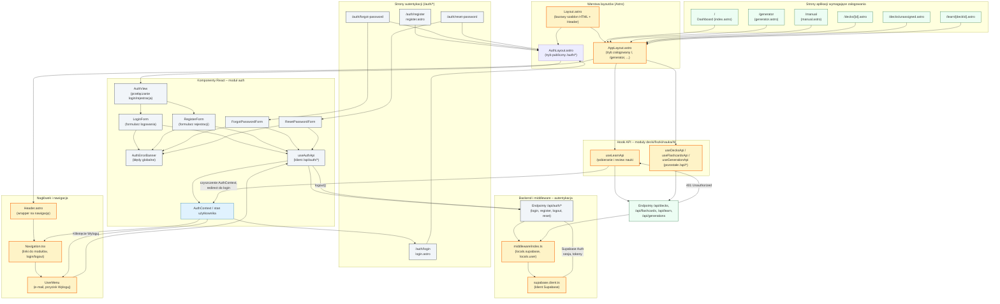

```mermaid
flowchart TD

%% =======================
%% Layouty i tryby aplikacji
%% =======================
subgraph Layouts["Warstwa layoutów (Astro)"]
  LayoutBase["Layout.astro\n(bazowy szablon HTML + Header)"]:::updated
  AuthLayout["AuthLayout.astro\n(tryb publiczny /auth/*)"]
  AppLayout["AppLayout.astro\n(tryb zalogowany /, /generator, ...)"]:::updated
end

LayoutBase --> AuthLayout
LayoutBase --> AppLayout

%% =======================
%% Strony auth (Astro) -> React
%% =======================
subgraph AuthPages["Strony autentykacji (/auth/*)"]
  LoginPage["/auth/login\nlogin.astro"]:::auth
  RegisterPage["/auth/register\nregister.astro"]:::auth
  ForgotPage["/auth/forgot-password"]:::auth
  ResetPage["/auth/reset-password"]:::auth
end

LoginPage --> AuthLayout
RegisterPage --> AuthLayout
ForgotPage --> AuthLayout
ResetPage --> AuthLayout

subgraph AuthReact["Komponenty React – moduł auth"]
  AuthViewCmp["AuthView\n(przełączanie login/rejestracja)"]:::auth
  LoginFormCmp["LoginForm\n(formularz logowania)"]:::auth
  RegisterFormCmp["RegisterForm\n(formularz rejestracji)"]:::auth
  ForgotFormCmp["ForgotPasswordForm"]:::auth
  ResetFormCmp["ResetPasswordForm"]:::auth
  AuthErrorBannerCmp["AuthErrorBanner\n(błędy globalne)"]:::auth
  UseAuthApiHook["useAuthApi\n(klient /api/auth/*)"]:::auth
  AuthContextNode["AuthContext / stan użytkownika"]:::shared
end

AuthLayout --> AuthViewCmp
AuthViewCmp --> LoginFormCmp
AuthViewCmp --> RegisterFormCmp
ForgotPage --> ForgotFormCmp
ResetPage --> ResetFormCmp
LoginFormCmp --> AuthErrorBannerCmp
RegisterFormCmp --> AuthErrorBannerCmp
ForgotFormCmp --> AuthErrorBannerCmp
ResetFormCmp --> AuthErrorBannerCmp

LoginFormCmp --> UseAuthApiHook
RegisterFormCmp --> UseAuthApiHook
ForgotFormCmp --> UseAuthApiHook
ResetFormCmp --> UseAuthApiHook

%% =======================
%% Backend auth + middleware
%% =======================
subgraph BackendAuth["Backend i middleware – autentykacja"]
  ApiAuth["Endpointy /api/auth/*\n(login, register, logout, reset)"]:::auth
  MiddlewareNode["middleware/index.ts\n(locals.supabase, locals.user)"]:::updated
  SupabaseClientNode["supabase.client.ts\n(klient Supabase)"]:::updated
end

UseAuthApiHook --> ApiAuth
ApiAuth --> MiddlewareNode
MiddlewareNode --> SupabaseClientNode
SupabaseClientNode ---|"Supabase Auth\nsesja, tokeny"| ApiAuth

UseAuthApiHook --> AuthContextNode

%% =======================
%% Strony prywatne (wymagające logowania)
%% =======================
subgraph PrivatePages["Strony aplikacji wymagające zalogowania"]
  IndexPage["/\nDashboard (index.astro)"]:::private
  GeneratorPage["/generator\n(generator.astro)"]:::private
  ManualPage["/manual\n(manual.astro)"]:::private
  DeckPage["/decks/[id].astro"]:::private
  UnassignedPage["/decks/unassigned.astro"]:::private
  LearnPage["/learn/[deckId].astro"]:::private
end

IndexPage --> AppLayout
GeneratorPage --> AppLayout
ManualPage --> AppLayout
DeckPage --> AppLayout
UnassignedPage --> AppLayout
LearnPage --> AppLayout

%% =======================
%% Nagłówek i nawigacja
%% =======================
subgraph HeaderNav["Nagłówek i nawigacja"]
  HeaderNode["Header.astro\n(wrapper na nawigację)"]:::updated
  NavigationCmp["Navigation.tsx\n(linki do modułów, login/logout)"]:::updated
  UserMenuCmp["UserMenu\n(e-mail, przycisk Wyloguj)"]:::updated
end

AppLayout --> HeaderNode
HeaderNode --> NavigationCmp
NavigationCmp --> UserMenuCmp
AuthContextNode --> NavigationCmp
AuthContextNode --> UserMenuCmp

%% Wylogowanie
UserMenuCmp -->|"Kliknięcie Wyloguj"| UseAuthApiHook
UseAuthApiHook -->|"logout()"| ApiAuth

%% =======================
%% Hooki API w części zalogowanej
%% =======================
subgraph PrivateHooks["Hooki API – moduły decki/fiszki/nauka/AI"]
  UseLearnApiHook["useLearnApi\n/pobieranie i review nauki"]:::updated
  OtherApiHooks["useDecksApi / useFlashcardsApi /\nuseGenerationApi (pozostałe /api/*)"]:::updated
end

AppLayout --> UseLearnApiHook
AppLayout --> OtherApiHooks

UseLearnApiHook --> ApiOther["Endpointy /api/decks,\n/api/flashcards, /api/learn,\n/api/generations"]:::private
OtherApiHooks --> ApiOther
ApiOther --> MiddlewareNode

%% Obsługa 401 i wygasłej sesji
ApiOther -- "401 Unauthorized" --> UseLearnApiHook
UseLearnApiHook -->|"czyszczenie AuthContext,\nredirect do login"| AuthContextNode
AuthContextNode --> LoginPage

%% =======================
%% Klasy stylów (wyróżnienia)
%% =======================
classDef auth fill:#f1f5f9,stroke:#0f172a,stroke-width:1px;
classDef private fill:#ecfdf3,stroke:#166534,stroke-width:1px;
classDef shared fill:#e0f2fe,stroke:#0369a1,stroke-width:1px;
classDef updated fill:#fef3c7,stroke:#f97316,stroke-width:2px;

class LayoutBase,AppLayout,HeaderNode,NavigationCmp,UserMenuCmp,UseLearnApiHook,OtherApiHooks,MiddlewareNode,SupabaseClientNode updated;
class LoginPage,RegisterPage,ForgotPage,ResetPage,AuthViewCmp,LoginFormCmp,RegisterFormCmp,ForgotFormCmp,ResetFormCmp,AuthErrorBannerCmp,UseAuthApiHook,ApiAuth auth;
class IndexPage,GeneratorPage,ManualPage,DeckPage,UnassignedPage,LearnPage,ApiOther private;
class AuthContextNode shared;
```
